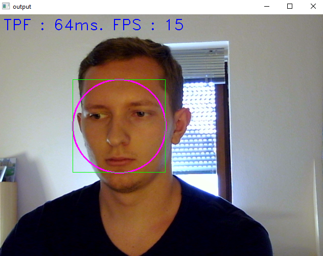

# Real-Time Face Detection System

## Introduction
Current implementation of real-time face detection systems uses <a href='https://www.cs.cmu.edu/~efros/courses/LBMV07/Papers/viola-cvpr-01.pdf'>Haar Cascade</a> (another good article on <a href='https://towardsdatascience.com/face-detection-with-haar-cascade-727f68dafd08#:~:text=So%20what%20is%20Haar%20Cascade,Simple%20Features%E2%80%9D%20published%20in%202001'>towardsdatascience</a>).
Problem of face detection is currently very important as those systems can be used for different embedded systems.
The idea of the project is to create such system using C++ and OpenCV.

## C++
C++ is a general-purpose programming language created by Danish computer scientist Bjarne Stroustrup as an extension of the C programming language, or "C with Classes". The language has expanded significantly over time, and modern C++ now has object-oriented, generic, and functional features in addition to facilities for low-level memory manipulation. It is almost always implemented as a compiled language, and many vendors provide C++ compilers, including the Free Software Foundation, LLVM, Microsoft, Intel, Oracle, and IBM, so it is available on many platforms (<a href='https://en.wikipedia.org/wiki/C%2B%2B'>continue</a>).

I like this programming language very much as it's allows you deeply understand how computer memory and processor works. And, in my opinion, combination of two difficult tasks (programming in C++ and Computer Vision) is good experience for every developer.

## Demonstration

This application allows you to test Face Detection in different modes.

### BGR (RGB) Face Detection

It's standard application mode. You don't need to press any keys for this.

### Grayscale Face Detection

To enable grayscale mode press 'G'. Face detection works better in this mode, because image has less noise.

### Threshold mode

To enable threshold mode press 'T' when you in grayscale mode. To modify threshold value pres '+'/'-' on your keyboard. This modes is really bad for face detection.

### Motion mode

You can't really detect face in this mode, it's possible but hard to catch frame. It's part of algorithms implementation for Computer Vision.

To enable motion mode press 'M' when you in grayscale mode.

## Build & run

### Install OpenCV
To install OpenCV on your specific platform you should use official <a href='https://docs.opencv.org/4.x/df/d65/tutorial_table_of_content_introduction.html'>Introduction to OpenCV</a> guide. It's best place to start anyway.

### Visual Studio
Originally everything was developed using Visual Studio and Visual Studio Compiler respectively.
To perform all configurations you need to put a lot of effort.

Firstly, add Include Directories and Library Directories. Go to 'Your Project' -> 'Properties' -> 'VC++ Directories' and set all necessary paths.

Secondly, go to 'Linker' -> 'Input' and specify your configuration to 'Debug'. Then add 'opencv_worldXXXd.lib' to Additional Dependencies, where XXX - version of OpenCV.

Last but not least, add 'opencv_worldXXX.lib' (without 'd' before '.lib') to Additional Dependencies for 'Release' configuration.

After that you will be able to build and run application.
